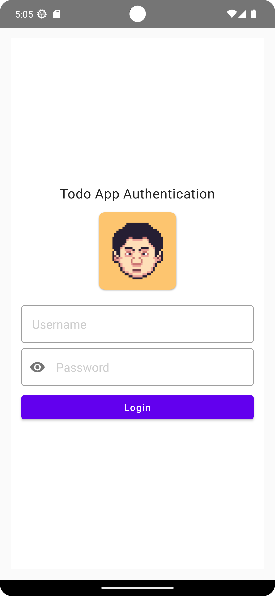
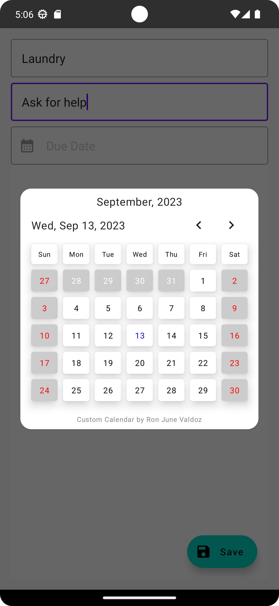
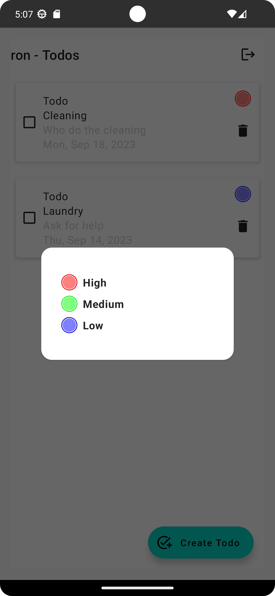

## TODO-App Cross-platform
- Project template from jetpack compose multiplatform
## Setup

- Kotlin: `1.9.10`

1. Please see how to setup in iOS here https://github.com/JetBrains/compose-multiplatform-template#readme
2. Download Android Studio (`Android Studio Giraffe | 2022.3.1 Patch 1`)
3. Download Java Version `17`
4. Download emulator with `SDK 33` (`only tested at SDK 33`)

## Extras
- [x] Added a basic custom calendar without using any third party library

## User guide

1. Login to proceed to todo list

     Please use sample credentials below (Username/Password)

      - `admin/admin`
      - `ron/ron`

         

2. Create a todo item

    

3. Select priority (Lower number means on top ) High: 1, Medium: 2, Low:3 
 
    

4. Toggle checkbox to mark as "Completed" otherwise "Todo" 

   

5. Press trash bin icon to delete todo item.

## App Feature
- [x] Add, edit, delete, and mark tasks as completed
- [x] Display tasks in a list format with a user-friendly interface.
- [x] Prioritize tasks with a simple prioritization mechanism.
- [x] Implement user authentication for saving tasks securely.

## Architecture & Patterns
- MVVM with Clean Architecture and Repository with Use-cases

## Dependencies
- [Compose] - Kotlin jetpack ui composition
- [Navigation] - Kotlin jetpack navigation
- [Realm] - Database

## For improvement
- [Koin] - use koin to organize dependencies

## License

## Author
Ron June Valdoz
